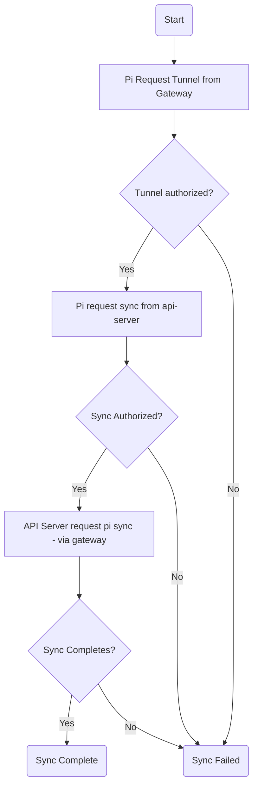

# rdsse-web-scraper

```mermaid
graph TD
    Start(Start) --> piReq[Pi Request Tunnel from Gateway]
    piReq --> piReqAuth{Tunnel authorized?}
    piReqAuth -- Yes --> reqSync[Pi request sync from api-server]
    piReqAuth -- No --> badEnd(Sync Failed)
    reqSync --> reqSyncAuth{Sync Authorized?}
    reqSyncAuth -- Yes --> startSync[API Server request pi sync - via gateway]
    reqSyncAuth -- No --> badEnd(Sync Failed)
    startSync --> syncCompletes{Sync Completes?}
    syncCompletes -- Yes --> goodend(Sync Complete)
    syncCompletes -- No --> badEnd(Sync Failed)
```
